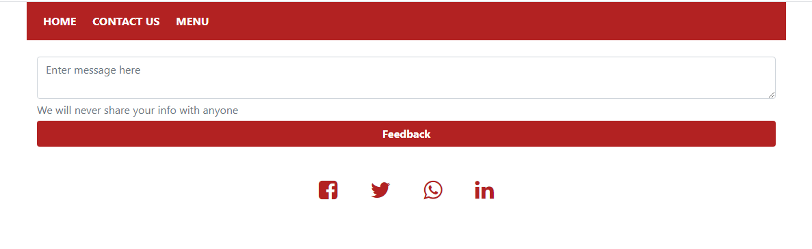
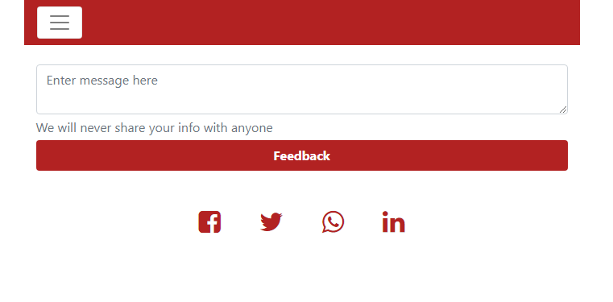

# Restaurant Page 

> Building a Restaurant page using vanilla Javascript.This project is part of a series of projects to be completed by students of microverse.org. Javascript es6 classes, es6 modules and webpack


## Screenshots

### Laptop/Desktop




### Tablet




### Mobile


## Built With

- HTML,
- CSS,
- Javascript es6 module, es6 classes
- Webpack
- Bootstrap

## Future Feature (V1.2)

- Remove bootstrap cdn and import bootstrap (webpack)
- Slider to display menu on home page
- Improve nav
- Add hover effect to display make order on menu page
- Re-position the nav on mobile device to the footer, to make it more mobile friendly


## Live Demo

[Live Demo Link](https://addod19.github.io/Restaurant-Page/)


## Getting Started

To get a local copy up and running follow these simple example steps.

1. ``` git clone https://github.com/addod19/Restaurant-Page.git ```
2. Open the index.html with your favorite browser
3. Explore our site
4. Make orders

### To compile your javascript file and wait for changes to re-compile

> run npx webpack --watch 

### To check for linter errors and possible fix
> run npx eslint .


### Prerequisites

- npm 6.13.4
- yarn 1.22.0

## Authors

👤 **Author1**

- Github: [@addod19](https://github.com/addod19)
- Twitter: [@DanielLarbiAdd1](https://twitter.com/DanielLarbiAdd1)
- Linkedin: [Daniel Larbi Addo](https://linkedin.com/in/daniel-larbi-addo/)
- Email: (addodaniellarbi@gmail.com)


## 🤝 Contributing

Contributions, issues and feature requests are welcome!

Feel free to check the [issues page](https://github.com/addod19/Restaurant-Page/issues).


1. Fork it (https://github.com/addod19/Restaurant-Page/fork)
2. Create your feature branch (git checkout -b my-new-feature)
3. Commit your changes (git commit -am 'Add some feature')
4. Push to the branch (git push origin my-new-feature)
5. Create a new Pull Request

## Show your support

Give us a ⭐️ if you like this project!

## Acknowledgments

- Hat tip to anyone whose code was used
- Inspiration
- etc

## 📝 License

This project is [MIT](lic.url) licensed.
