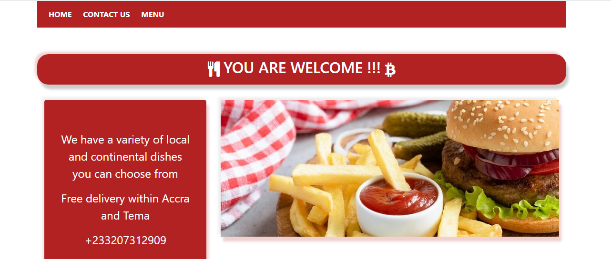
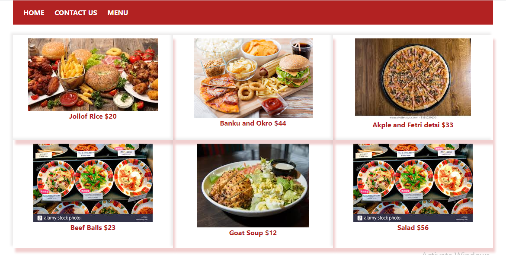

# Restaurant Page 

> Building a Restaurant page using vanilla Javascript.


## Screenshots

### Large Screen





## Built With

- HTML,
- CSS,
- Javascript es6 module, es6 classes
- Webpack
- Bootstrap

## Live Demo

[Live Demo Link](https://addod19.github.io/Restaurant-Page/)


## Getting Started

To get a local copy up and running follow these simple example steps.

1. ``` git clone https://github.com/addod19/Restaurant-Page.git ```
2. Open the index.html with your favorite browser
3. Explore our site
4. Make orders

### Prerequisites

- A modern browser

## Authors

👤 **Author1**

- Github: [@addod19](https://github.com/addod19)
- Twitter: [@DanielLarbiAdd1](https://twitter.com/DanielLarbiAdd1)
- Linkedin: [Daniel Larbi Addo](https://linkedin.com/in/daniel-larbi-addo/)


## 🤝 Contributing

Contributions, issues and feature requests are welcome!

Feel free to check the [issues page](https://github.com/addod19/Restaurant-Page/issues).


1. Fork it (https://github.com/addod19/Restaurant-Page/fork)
2. Create your feature branch (git checkout -b my-new-feature)
3. Commit your changes (git commit -am 'Add some feature')
4. Push to the branch (git push origin my-new-feature)
5. Create a new Pull Request

## Show your support

Give us a ⭐️ if you like this project!

## Acknowledgments

- Hat tip to anyone whose code was used
- Inspiration
- etc

## 📝 License

This project is [MIT](lic.url) licensed.
